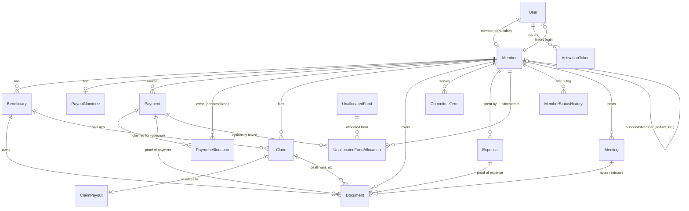
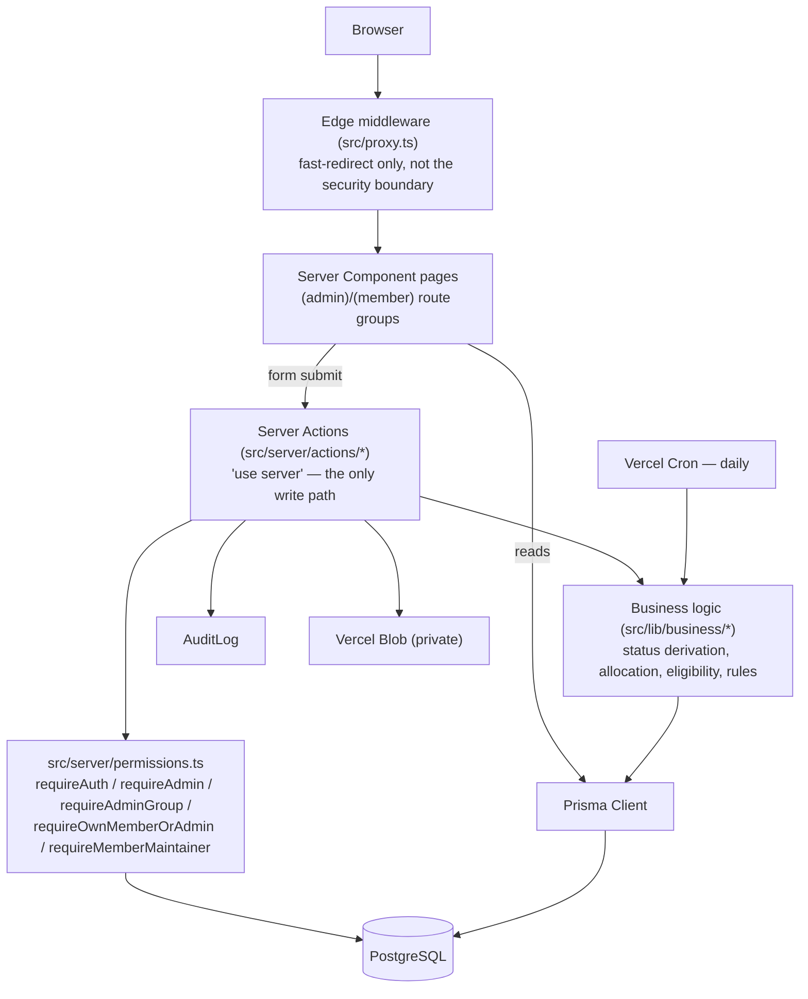

# Ramulondi Burial Society — Application Requirements Specification

## 1. Introduction

### 1.1 Purpose
This document specifies the functional and non-functional requirements of the Ramulondi Burial Society management application: what it does, the business rules it enforces, how its data is modeled, how it is architected, and how it is secured.

### 1.2 What this system replaces
Previously, membership, contributions, and claims were tracked in an Excel workbook with formula-driven status/lapse logic, maintained manually by the committee. This application replaces that workbook with a web application that:
- Gives each member a self-service portal (profile, beneficiaries, contribution history, claims, meetings).
- Gives the committee an admin portal covering membership, beneficiaries, claims, committee terms, meetings, expenses, and finance.
- Automates membership status derivation, contribution apportionment, and claim-eligibility checks that were previously manual, spreadsheet-formula judgment calls.
- Keeps an audit trail of sensitive actions.

### 1.3 Intended audience
The Ramulondi Burial Society committee (as the system owner and business-rule authority), and any developer maintaining or extending the application.

### 1.4 Scope
In scope: membership administration, beneficiary management, contribution collection and apportionment, claims and payouts, committee-term tracking, meeting scheduling and minutes, expense and unallocated-fund tracking, PDF reporting, and the account-activation/authentication model that fronts all of it.

Out of scope (deliberately not built): public self-service signup, online payment collection/gateway integration, SMS/WhatsApp notifications, and column-level encryption at rest (see §7.5).

## 2. User Roles

| Role | Description |
|---|---|
| **Member** | A person with a `Member` record and a linked login. Can view/manage their own profile, beneficiaries, contribution history, and file claims. |
| **Admin — Super Admin** | Full access to every admin function, including rates, user management, settings, and the audit log. |
| **Admin — Treasurer** | Financial operations: expenses, unallocated funds, contribution rates (record only — not create), payment recording, claim payouts. |
| **Admin — Secretary** | Membership maintenance: create/edit members, beneficiaries, review (approve/reject) claims. |
| **Admin — Chairperson** | Read access to all admin screens; no group-specific write permissions beyond what every admin gets (see §7.2 for the exact matrix). |

An admin *may* also be linked to their own `Member` record (e.g., a committee member who is also a paying member), in which case they see both the admin portal and their own member profile.

## 3. Functional Requirements

### 3.1 Membership management
- Admins (Super Admin/Secretary) can register a new member with required fields (first name, surname, gender, membership type, date joined, phone) and optional fields (ID number, email, package note, succession link).
- A member can be created as a **draft** (only first name, surname, gender, and type required) via a two-step wizard, completed later.
- Membership numbers are generated automatically and are unique.
- Membership status (Active / About to lapse / Lapsed-terminated / Deceased) is derived automatically, not manually set (see §4.1).
- A spouse/dependent taking over a deceased member's policy is registered as a new, independent `Member` record, linked back to the one they succeeded (never a data merge).
- Admins can search and filter the member list by name, membership number, and status; the list shows beneficiary count, claim count, current-year contributions, and (for lapsed/about-to-lapse members) the termination date.
- Members without a login are activated via an admin-generated, one-time activation link (handed to the member offline) — there is no public signup.

### 3.2 Beneficiaries
- A member can register beneficiaries (dependents) with a relationship type (Father, Mother, Spouse, Son, Daughter, Dependent, Other).
- At most one Father and one Mother per member (see §4.4).
- A beneficiary can be soft-deleted, with the 12-month single-deletion rule enforced (see §4.4).
- A beneficiary already recorded as deceased cannot be re-registered under any member.
- When a member is recorded deceased, their beneficiaries can be reallocated to another member's policy.

### 3.3 Contributions & payments
- Admins (Treasurer/Super Admin) record payments against a member: category (monthly contribution or joining fee), amount, date, method, reference, and optional proof-of-payment upload.
- A monthly-contribution payment is automatically apportioned across the member's outstanding months and funds (Burial + Food), oldest first (see §4.2).
- Contribution rates are maintained per membership type and fund, effective-dated so a rate change never rewrites history.
- Members can view their own contribution history by year/month, download a proof-of-payment receipt for any payment, and download an annual contribution statement (PDF).
- Members and admins can see a member's current outstanding balance at any time.

### 3.4 Claims & payouts
- A member (or someone filing on a family member's behalf) can submit a claim for their own death or a beneficiary's death, giving date of death, place of burial, payout recipient details, and bank details.
- A death certificate can be attached to a claim (uploaded by the claimant or an admin).
- Claim submission eligibility and payout authorization are two **separate** checks (see §4.3) — a claim can be filed and even approved while a payout is withheld.
- An admin (Secretary/Super Admin) reviews a pending claim and approves or rejects it; approval is what marks the member/beneficiary deceased (not submission).
- Once approved, an admin (Treasurer/Super Admin) can record the payout (paid date, paid-to, notes); the payout amount itself is computed automatically from the current claim rates, not hand-typed.
- Payout amount = base payout, plus an additional amount if burial is not at Khalavha.

### 3.5 Committee management
- Admins (Super Admin) assign a member to a committee role (Chairperson, Vice Chair, Secretary, Vice Secretary, Treasurer, two Additional Member seats, Youth Coordinator) with a start date.
- Assigning a new holder to a role automatically ends the incumbent's term.
- Only Active or About-to-lapse members are eligible for a committee position.
- Full committee history (not just current holders) is retained and visible to any signed-in user.

### 3.6 Meetings
- Admins can schedule a meeting: type (Committee Meeting, Quarterly, AGM, Special AGM), date, venue, and host (a member).
- Admins can upload meeting notes/minutes against a scheduled meeting once it has taken place.
- The admin meetings screen shows a month-view calendar plus separate upcoming/past meeting lists.
- Members see their society's upcoming meetings highlighted on their dashboard when they log in, and can view the full upcoming/past meeting history (with notes) on a dedicated screen.
- Meeting history and its notes are retained indefinitely — there is no delete function.

### 3.7 Expenses
- Admins (Treasurer/Super Admin) record a society expense: description, amount, date, which committee member spent it, which committee role approved it, and a required receipt/slip upload (an expense cannot exist without proof, unlike other document uploads which are a separate follow-up step).

### 3.8 Unallocated funds
- Admins (Treasurer/Super Admin) record a deposit (cash or EFT) that isn't yet tied to a specific member's contribution.
- The deposit can later be allocated (in full or in part, across multiple members) once reconciled; a running "remaining" balance is tracked automatically.

### 3.9 Reports & analytics
- Admin dashboard: membership-status breakdown (tiles + pie chart, live for the current year, reconstructed from history for a past year — see §5.2), pending-claims count, total collected/burial payouts/other expenses (current year or all-time), unallocated funds, and a funds-collected-by-year table with a projected-vs-actual comparison.
- Analytics dashboard: the same status/financial charts plus a membership-growth-by-join-year-cohort table.
- Income statement: monthly income vs. expenditure breakdown and totals for a selected year.
- Downloadable PDF reports: annual general report, per-member contribution statement, proof of payment, and society statement (every member's contribution total for a year).
- All monetary values are displayed as `R #,##0.00`; all dates as `dd/mm/yyyy`.

### 3.10 Documents
- Every uploaded file (member/beneficiary ID proof, death certificate, payment proof, expense proof, meeting notes) is stored privately and streamed only through an authenticated, permission-checked route — never a public URL.
- Allowed file types: JPEG, PNG, PDF. Maximum size: 5MB.

### 3.11 Settings
- Super Admins can edit the configurable business-rule thresholds (§4.6) without a code deploy.

### 3.12 Audit log
- Super Admins can view a log of sensitive actions: record creation/update/deletion, status changes, document views, login successes/failures, and sensitive-field reveals — each entry records who performed it, when, and against which entity/member.

## 4. Business Rules

### 4.1 Membership status derivation
Status is **derived**, not manually set (except `DECEASED`, which is set via claim approval or a direct admin edit). The derivation mirrors the source spreadsheet's formulas, with one correction: a member is not penalized for months before they joined.

Given a member's start date (reinstatement date if set, otherwise join date) and today's date:
1. If `deceasedDate` is set → **Deceased**.
2. If the member's start month is still in the future → **Active**.
3. Count how many full calendar months, from the start month through the current month, were paid in full (against the effective rate for that month). The **gap** is elapsed months minus fully-paid months.
4. If the gap ≥ the arrears-lapse threshold (default **6 months**):
   - If the projected termination date (last-paid month + lapse threshold) has already passed → **Lapsed/terminated**, with a recorded termination date.
   - Otherwise → **About to lapse**, with a projected (not yet final) termination date.
5. Else if the gap > the arrears-warning threshold (default **3 months**) → **About to lapse**.
6. Otherwise → **Active**.

This runs automatically after every write that could change it (payment recorded, deceased date set) and once daily via a scheduled job across every member. Every real status transition (plus a one-time baseline per member) is logged to a history table, so a report can reconstruct "what was this member's status as of a past date" — not just today's live value.

### 4.2 Contribution apportionment
A monthly-contribution payment is split across the member's outstanding periods, oldest first, within a 24-month forward window from the payment date:
- For each outstanding month (starting from the member's join/reinstatement month), the amount due is the effective combined Burial+Food rate for that month, minus whatever's already allocated to it.
- If the payment fully covers a month's outstanding amount, the full amount is allocated (split across Burial/Food) and the payment moves to the next outstanding month.
- If the payment only partially covers a month, it is split proportionally between Burial and Food for that final month, and allocation stops there.
- Any amount that still can't be allocated within the 24-month window is flagged in the payment's notes for manual admin follow-up — never silently dropped.
- A joining-fee payment is recorded as-is, with no apportionment.

### 4.3 Claim eligibility vs. payout authorization
These are deliberately **separate** checks:

**Submission eligibility** (`checkClaimSubmissionEligibility`) — a claim can only be *filed* if:
- The member is not already recorded deceased.
- (For a beneficiary claim) the beneficiary belongs to that member, is not already deceased, and has no existing claim.
- (For a member-level claim) no existing claim already exists for that member.
- The date of death is on/after the end of the cooling-off period from the member's join date (default **6 months**).
- The member's own status, evaluated **as of the date of death**, was not already Lapsed/terminated (6+ consecutive months in arrears) at that point.

**Payout authorization** (`assertPayoutAllowed`) — a claim can only be *paid out* if the member's contribution balance is fully settled (outstanding balance = R0), even if the claim itself was approved while arrears existed. This is enforced separately from and after review approval.

Payout amount is computed automatically (not entered by hand) from the currently effective claim rates: a flat base amount, plus an additional amount if the burial site is not Khalavha.

### 4.4 Beneficiary rules
- At most one `FATHER` and one `MOTHER` beneficiary per member, enforced both at the application layer (friendly error) and at the database layer (partial unique indexes on `Beneficiary(memberId) WHERE relationship = 'FATHER'/'MOTHER' AND deletedAt IS NULL`) — the database index is the actual source of truth under concurrent writes.
- At most one beneficiary deletion per member within a rolling window (default **12 months**), tracked via the audit log.
- A beneficiary already recorded `DECEASED` (matched globally by ID number, including soft-deleted rows) cannot be re-registered, under any member.

### 4.5 Committee eligibility
Only members with status `ACTIVE` or `ABOUT_TO_LAPSE` can be assigned to a committee role. Assigning a new holder to a role automatically closes off the incumbent's term as of the new term's start date.

### 4.6 Configurable business-rule thresholds
These live in the database (`AppSetting` table) and are editable by a Super Admin at `/admin/settings` — no code deploy required to change them:

| Setting | Default | Governs |
|---|---|---|
| `COOLING_OFF_MONTHS` | 6 | Minimum months from join date before a claim can be filed |
| `ARREARS_LAPSE_MONTHS` | 6 | Consecutive months in arrears before a member lapses/terminates |
| `ARREARS_WARNING_MONTHS` | 3 | Consecutive months in arrears before a member shows "about to lapse" |
| `BENEFICIARY_DELETION_WINDOW_MONTHS` | 12 | Rolling window for the one-deletion-per-period rule |
| `JOINING_FEE_AMOUNT` | R400 | Reference/display value only — **not enforced**; the actual joining-fee amount is entered per payment by the admin recording it |

Contribution rates (`ContributionRate`, per membership type + fund) and claim rates (`ClaimRate`, base payout + additional burial-site amount) are separately maintained, effective-dated tables — not simple key/value settings — since they need full history, not just a current value.

### 4.7 Validation rules
- **SA ID number**: exactly 13 digits, valid embedded date of birth, and a passing Luhn-style checksum on the 13th digit. Also derives date of birth, gender, and citizenship from the number.
- **SA phone number**: accepts local (`0821234567`) or international (`+27821234567`) form; normalized to `+27…` before storage; must match a valid SA mobile/landline prefix.

## 5. Database Design

### 5.1 Entity-relationship diagram

`ContributionRate`, `ClaimRate`, `AppSetting`, and `AuditLog` are referenced by ID/type from business logic rather than by a Prisma relation, so they're omitted from the diagram's connections but listed below for completeness.

### 5.2 Entities by domain

**Auth & access**
- **User** — login/credentials (email or phone + password hash). `role` (`MEMBER`/`ADMIN`) and, for admins, `adminGroup` drive RBAC. `memberId` is nullable and unique — most Users are one-to-one with a Member, but an admin need not have a membership. Tracks `failedLoginCount`/`lockedUntil` for lockout and `disabled`/`disabledReason` for revocation.
- **ActivationToken** — one-time tokens for the no-public-signup activation flow.

**Membership**
- **Member** — the core entity: identity, `type` (Main/Khadzi), `status` (derived, see §4.1), join/reinstatement/deceased/termination dates, `isDraft` flag, and a self-referential `succeedsMemberId` for policy succession.
- **MemberStatusHistory** — append-only log of every status transition, enabling "status as of a past date" reconstruction (see §4.1). Not exposed for editing; written only by the status-refresh logic.
- **Beneficiary** — dependents registered against a member; globally unique `referenceNo`; soft-deleted via `deletedAt` (never hard-deleted, to preserve claim history); Father/Mother uniqueness enforced by partial unique indexes.
- **PayoutNominee** — one-to-one with Member; the member's own designated payout recipient if a claim is made against their own policy.

**Committee**
- **CommitteeTerm** — a member's tenure in a role, with start/nullable-end date; history preserved across multiple terms.

**Meetings**
- **Meeting** — type, date, venue, and host (a Member); notes are attached via `Document`.

**Contributions & payments**
- **ContributionRate** — monthly rate per (membership type, fund), effective-dated.
- **Payment** — a single payment event (monthly contribution or joining fee).
- **PaymentAllocation** — the apportionment of a Payment into specific (fund, year, month) buckets; `memberId` is denormalized here for efficient per-member ledger queries.

**Claims**
- **Claim** — filed against a Member (required) and optionally a specific Beneficiary; captures burial site, payout recipient/bank details, and status (`PENDING → APPROVED/REJECTED → PAID`).
- **ClaimPayout** — one-to-one with a Claim; created once actually paid, kept separate from `Claim.status` so "paid" is an unambiguous, timestamped fact.
- **ClaimRate** — versioned payout amounts by type (base / additional burial-site), same effective-dating pattern as `ContributionRate`.

**Finance**
- **Expense** — a society expense, attributed to who spent it and which committee role approved it.
- **UnallocatedFund** / **UnallocatedFundAllocation** — a deposit not yet tied to a member, and the record of assigning part/all of it to specific members.

**Documents & audit**
- **Document** — a single row type for every uploaded file, disambiguated by `ownerType` plus whichever owner FK (`memberId`/`beneficiaryId`/`claimId`/`paymentId`/`expenseId`/`meetingId`) is set; `storageKey` points at a private blob object with no public URL.
- **AuditLog** — append-only trail of sensitive actions (`entityType`/`entityId`/`action`/`performedByUserId`/`metadata`).
- **AppSetting** — key/value store for the configurable thresholds in §4.6.

### 5.3 Enums

| Enum | Values |
|---|---|
| `Role` | `MEMBER`, `ADMIN` |
| `AdminGroup` | `SUPER_ADMIN`, `TREASURER`, `SECRETARY`, `CHAIRPERSON` |
| `Gender` | `MALE`, `FEMALE` |
| `MembershipType` | `MAIN`, `KHADZI` |
| `MemberStatus` | `ACTIVE`, `ABOUT_TO_LAPSE`, `IN_ACTIVE`, `DECEASED` |
| `Fund` | `BURIAL`, `FOOD` |
| `RelationshipType` | `FATHER`, `MOTHER`, `SPOUSE`, `SON`, `DAUGHTER`, `DEPENDENT`, `OTHER` |
| `PaymentCategory` | `MONTHLY_CONTRIBUTION`, `JOINING_FEE` |
| `ClaimStatus` | `PENDING`, `APPROVED`, `REJECTED`, `PAID` |
| `DocumentOwner` | `MEMBER_ID_PROOF`, `BENEFICIARY_ID_PROOF`, `DEATH_CERTIFICATE`, `PAYMENT_PROOF`, `EXPENSE_PROOF`, `MEETING_NOTES` |
| `BeneficiaryStatus` | `ACTIVE`, `INACTIVE`, `DECEASED` |
| `CommitteeRole` | `CHAIRPERSON`, `VICE_CHAIR`, `SECRETARY`, `VICE_SECRETARY`, `TREASURER`, `ADDITIONAL_MEMBER`, `ADDITIONAL_MEMBER_2`, `YOUTH_COORDINATOR` |
| `BurialSite` | `KHALAVHA`, `OTHER` |
| `ClaimRateType` | `BASE_PAYOUT`, `ADDITIONAL_BURIAL_SITE` |
| `DepositType` | `CASH`, `EFT` |
| `MeetingType` | `COMMITTEE_MEETING`, `QUARTERLY`, `AGM`, `SPECIAL_AGM` |
| `AuditAction` | `CREATE`, `UPDATE`, `DELETE`, `STATUS_CHANGE`, `VIEW_DOCUMENT`, `LOGIN_FAILURE`, `LOGIN_SUCCESS`, `REVEAL_SENSITIVE_FIELD` |

## 6. Application Architecture

### 6.1 Tech stack

| Layer | Choice |
|---|---|
| Framework | Next.js 16 (App Router, TypeScript, React Server Components + Server Actions) |
| Database | PostgreSQL (Neon), via Prisma ORM 6 |
| Auth | Auth.js (NextAuth) v5 — Credentials provider, JWT sessions |
| File storage | Vercel Blob, private access mode only |
| Validation | Zod, plus hand-written SA ID/phone validators |
| Charts | Recharts |
| PDF reports | `@react-pdf/renderer` |
| Testing | Vitest (unit), Playwright (ad hoc E2E verification) |
| Hosting | Vercel (app + scheduled job), Neon (Postgres), Vercel Blob (files) |

### 6.2 Request-flow architecture

Two decisions shape this diagram:
1. **RBAC is enforced twice.** Edge middleware redirects unauthenticated/wrong-role users for fast UX, but every server action independently re-checks permission via `src/server/permissions.ts` before touching the database — middleware can be bypassed by invoking a server action directly.
2. **Server Actions are the only write path.** There is no separate REST/GraphQL mutation API. Pages read via Prisma directly (React Server Components); every write goes through a `"use server"` function following the same shape: validate (Zod) → permission check → business logic → Prisma write → audit log → revalidate.

### 6.3 Route structure

| Path | Guard |
|---|---|
| `/admin/*` | Authenticated + `role = ADMIN` |
| `/dashboard`, `/beneficiaries`, `/contributions`, `/claims`, `/committee`, `/meetings`, `/profile` | Authenticated + has a linked `memberId` |
| `/login`, `/activate/[token]` | Public |
| `/api/documents/[id]` | Authenticated + ownership/role/meeting-notes check (see §7.6) |
| `/api/cron/update-member-status` | `CRON_SECRET` bearer token, not a user session |
| `/api/reports/*` | Authenticated + permission check per report |

## 7. Security

### 7.1 Authentication
- Credentials-based login (email or phone + password), JWT session strategy.
- Passwords hashed with bcrypt.
- New accounts are created with `mustChangePassword = true` and a placeholder password; the member sets their real password via a one-time activation token, never via public signup.
- Activation tokens are single-use, expire after 7 days, and are only ever generated by an admin.

### 7.2 Authorization (RBAC matrix)

| Action | Who |
|---|---|
| Create/edit member, reallocate beneficiaries of a deceased member | Super Admin, Secretary |
| Review (approve/reject) a claim | Super Admin, Secretary |
| Record a claim payout | Super Admin, Treasurer |
| Assign a committee role | Super Admin |
| Manage contribution rates, claim rates | Super Admin |
| Record a payment | Super Admin, Treasurer |
| Record an expense, record/allocate unallocated funds | Super Admin, Treasurer |
| Manage user accounts (enable/disable, change role/group) | Super Admin |
| Edit configurable settings (§4.6) | Super Admin |
| View audit log | Any Admin can reach the page (`requireAdmin()`); the nav link itself is shown only to Super Admins |
| Schedule a meeting / upload meeting notes | Any Admin |
| View member list, claims list, committee history, reports | Any Admin |
| View/edit own profile, beneficiaries, claims, contributions | The member themself, or any Admin |
| View meeting notes | Any signed-in user (member or admin) — deliberately not owner-restricted |

A disabled or currently-locked-out `User` is rejected on every protected call, not just at login — `requireAuth()` re-fetches the `User` row from the database on every call rather than trusting the JWT alone, so a role change or account disablement takes effect on the very next action.

### 7.3 Account lockout
5 consecutive failed login attempts locks the account for 15 minutes. Every failed and successful login attempt is written to the audit log.

### 7.4 Input validation
Every server action re-validates its input server-side with Zod, independent of client-side form validation — client-side checks are a UX convenience, never the enforcement point.

### 7.5 Sensitive data handling
- ID numbers and banking details are masked in the UI by default (e.g. only the last 4 digits of an ID number shown) and never bulk-serialized to the client.
- Full column-level encryption at rest was deliberately not built for v1 (flagged as a future item if the society's risk profile changes) — data is protected by database-level access control and the application's own permission checks instead.

### 7.6 File storage & document access
- Files are uploaded to Vercel Blob in **private** access mode — there is no public URL for any uploaded document.
- Every read goes through `/api/documents/[id]`, which: confirms the requester is signed in, checks ownership (the document's member/beneficiary/claim owner must match the requester, unless the requester is an admin or the document is a meeting-notes file), streams the file server-side, and logs a `VIEW_DOCUMENT` audit entry.
- Allowed types: JPEG, PNG, PDF. Max size: 5MB.

### 7.7 Audit logging
Every sensitive action is logged via a single shared helper (`logAudit()`) rather than ad hoc inserts, keeping the shape consistent: entity type/ID, the member it relates to (if any), the action taken, who performed it, when, and optional structured metadata.

### 7.8 Deployment & migration safety
- Migrations are hand-reviewed SQL files under `prisma/migrations/`, applied via `prisma migrate deploy` inside the Vercel build — never generated with `prisma migrate diff` against the live database (a shadow-database misconfiguration during development previously caused unintended data loss, since remediated; the safe pattern is now: hand-write or generate the migration against a genuinely separate scratch database, never the real `DATABASE_URL`/`DIRECT_URL`).
- The daily status-refresh job authenticates via a bearer-token `CRON_SECRET`, not a user session.
- Environment secrets (`NEXTAUTH_SECRET`, `CRON_SECRET`, database URLs, blob token) are never committed to source control.

## 8. Non-Functional Requirements

- **Testing**: business logic (status derivation, contribution allocation, claim eligibility, beneficiary rules, SA ID/phone validation, calendar math) is unit-tested with Vitest; feature work is additionally verified live (Playwright) against a real database before being considered done.
- **Responsiveness**: every screen is usable from a mobile viewport up through desktop; tables progressively hide lower-priority columns rather than overflowing, and status is never one of the columns hidden.
- **Accessibility of financial data**: all monetary values use a single consistent format (`R #,##0.00`) and all dates a single consistent format (`dd/mm/yyyy`) across every screen and PDF report.
- **Availability**: hosted on Vercel with the database on Neon (managed Postgres); the daily status-refresh cron runs once a day, matching the Hobby-plan cron cadence.
