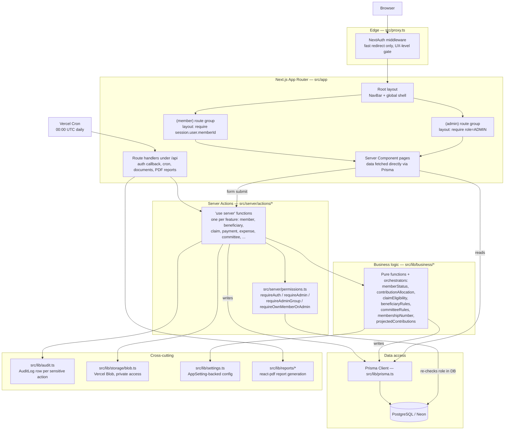
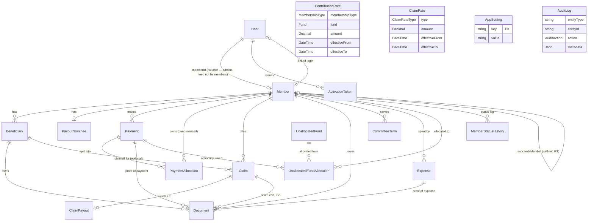

# Ramulondi Burial Society — System Documentation

This document describes the application's architecture and data model. For setup, deployment, and business-rule specifics, see the top-level [README.md](../README.md) — this document focuses on *how the system is structured*, not how to run it.

## 1. Overview

The app is a membership, contributions, and claims management system for a burial society, replacing a spreadsheet-driven process. It has two audiences sharing one codebase:

- **Members** — a self-service portal to view their profile, beneficiaries, contribution history, and submit claims.
- **Admins** (four groups: Super Admin, Treasurer, Secretary, Chairperson) — full member/beneficiary/claims/rates/finance management and an audit trail.

## 2. Tech stack

| Layer | Choice |
|---|---|
| Framework | Next.js 16 (App Router, TypeScript, React Server Components + Server Actions) |
| Database | PostgreSQL (Neon), accessed via Prisma ORM 6 |
| Auth | Auth.js (NextAuth) v5 — Credentials provider (email/phone + password), JWT sessions |
| File storage | Vercel Blob, private access mode only |
| Validation | Zod, plus hand-written SA ID number and SA phone number validators |
| Charts | Recharts |
| PDF reports | `@react-pdf/renderer` |
| Spreadsheet import | ExcelJS |
| Testing | Vitest (business-logic unit tests), Playwright (ad hoc E2E verification) |
| Hosting | Vercel (app + cron), Neon (Postgres), Vercel Blob (files) |

## 3. Request-flow architecture



Two things are deliberate about this shape:

1. **RBAC is enforced twice, never once.** `src/proxy.ts` (edge middleware) redirects unauthenticated/wrong-role users away from a route group for a fast UX — but it is *not* the security boundary. Every server action and API route independently calls into `src/server/permissions.ts` (`requireAuth`, `requireAdmin`, `requireAdminGroup(...)`, `requireOwnMemberOrAdmin`) before touching Prisma, because middleware can be bypassed by invoking a server action directly. `requireAuth` re-fetches the `User` row from the database on every call rather than trusting the JWT alone, so a disabled account or admin-group change takes effect on the very next action, not just at next login.
2. **Server Actions are the only write path.** There is no separate REST/GraphQL API for mutations — pages are React Server Components that read via Prisma directly, and forms/buttons submit to `"use server"` functions in `src/server/actions/`. Each action follows the same shape: parse/validate input with Zod → permission check → delegate to business logic (`src/lib/business/`) → Prisma write → `logAudit(...)` for sensitive actions → return a typed `ActionResult`.

### Route groups

| Path prefix | Group | Layout guard (`src/app/.../layout.tsx`) |
|---|---|---|
| `/admin/*` | `(admin)` | Redirects to `/login` if unauthenticated, to `/dashboard` if not `role=ADMIN` |
| `/dashboard`, `/beneficiaries`, `/contributions`, `/claims`, `/profile`, `/committee` | `(member)` | Redirects to `/login` if unauthenticated, to `/admin/dashboard` if the signed-in user has no `memberId` (i.e. an admin with no linked membership) |
| `/login`, `/activate/[token]`, `/post-login` | none | Public / transitional pages (account activation, post-login role routing) |
| `/api/*` | none | Route handlers — see below |

### `/api` route handlers

| Route | Purpose |
|---|---|
| `/api/auth/[...nextauth]` | NextAuth's own handler (session/JWT machinery) |
| `/api/cron/update-member-status` | Called daily by Vercel Cron (`vercel.json`, `00:00 UTC`); runs `refreshAllMemberStatuses()` across every member. Guarded by a `CRON_SECRET` bearer check. |
| `/api/documents/[id]` | The **only** way to read an uploaded file. Checks the requester's ownership/role against the `Document` row, streams the blob server-side from Vercel Blob (never a public blob URL), and logs a `VIEW_DOCUMENT` audit entry. |
| `/api/reports/annual-general-report/[year]`, `/api/reports/contribution-statement/[memberId]/[year]`, `/api/reports/proof-of-payment/[paymentId]`, `/api/reports/society-statement/[year]` | Stream a generated PDF (`@react-pdf/renderer`, via `src/lib/reports/*`) after the same permission checks as any other route. |

### Directory map

```
src/
  app/                 Route groups, pages, layouts, API route handlers
    (admin)/admin/...  Admin portal pages (members, claims, committee, expenses, rates, reports, settings, users, audit log)
    (member)/...       Member self-service pages (dashboard, beneficiaries, contributions, claims, committee, profile)
    api/...             Route handlers (auth, cron, documents, PDF reports)
  components/
    ui/                 Generic primitives: Button, Card, Modal, StatusBadge, SearchSelect, DeltaPill
    forms/              Form primitives: Field, FieldLabel, FormKey, OptionalSection, ActionForm, DeleteButton, InviteButton, BankNameField
    layout/             NavBar, HamburgerMenu
    charts/             Recharts wrappers (contributions, income/expenditure, fund split, member-status pie)
  server/
    permissions.ts      RBAC checks shared by every action/route
    actions/            One "use server" module per feature (member, beneficiary, claim, payment, expense, committee, claimRate, payoutNominee, unallocatedFund, userAccount, settings, activation, document)
  lib/
    auth.ts             NextAuth config (Credentials provider, JWT/session callbacks, lockout logic)
    prisma.ts           Singleton Prisma Client (dev-mode HMR-safe)
    audit.ts            logAudit() helper — every sensitive action writes an AuditLog row
    settings.ts         Typed getSetting() over the AppSetting table (runtime-configurable business rules)
    accountStatus.ts, statusColors.ts, statusLabels.ts, chartColors.ts   Shared UI-facing enums/labels/colors
    business/           Pure/orchestrating business logic (see §4)
    validation/         Zod schemas, SA ID/phone validators
    reports/            react-pdf report layouts and generators
    storage/blob.ts      Vercel Blob upload/fetch/delete, private-access only
  proxy.ts              Edge middleware (fast-path RBAC redirects only)
  types/                Ambient type augmentation (next-auth.d.ts)
prisma/
  schema.prisma         Full data model (see §5)
  migrations/           One hand-reviewed SQL migration per schema change
  seed.ts               Seeds AppSetting defaults, 2026 contribution rates, one admin user
scripts/
  import-xlsx.ts        One-off importer for the legacy Excel workbook
```

## 4. Business logic layer (`src/lib/business/`)

This is where the domain rules live, kept independent of Next.js/Prisma request plumbing where possible so it's directly unit-testable (see `__tests__` alongside each file).

| Module | Responsibility |
|---|---|
| `memberStatus.ts` | Derives a member's status (`ACTIVE` / `ABOUT_TO_LAPSE` / `IN_ACTIVE` / `DECEASED`) and termination date from payment history, mirroring the source spreadsheet's formulas (with a fix for mid-year joiners). `refreshMemberStatus()` persists the result and now also writes a `MemberStatusHistory` row on every real transition (plus a one-time baseline row per member) — see §5.2. Runs after any write that could change status, and once daily via the cron route. |
| `contributionAllocation.ts` | Apportions a lump-sum payment across outstanding months and funds (Burial + Food), even across a mid-year rate change; computes outstanding balance. |
| `claimEligibility.ts` | Two deliberately separate checks per the society's constitution: claim *submission* eligibility (cooling-off period, one claim per member, member wasn't already lapsed at death) vs. payout *authorization* (blocked while any contribution balance is outstanding). |
| `beneficiaryRules.ts` | At most one Father and one Mother beneficiary per member (mirrored at the DB level, see §5.7), and the 12-month beneficiary-deletion cooldown. |
| `committeeRules.ts` | Committee term/role assignment rules. |
| `membershipNumber.ts` | Generates unique, sequential membership numbers. |
| `projectedContributions.ts` | Projects expected contribution totals from current active membership counts and effective rates (used on the dashboard's yearly table; explicitly labeled an approximation since historical headcount isn't tracked). |

Business rules that are *configurable by the society's AGM* (cooling-off period, joining fee, arrears warning/lapse thresholds, beneficiary-deletion window) are **not hardcoded** — they live in the `AppSetting` key/value table, editable at `/admin/settings` via `src/lib/settings.ts`'s typed `getSetting()`, so a rule change never requires a code deploy.

## 5. Data model

### 5.1 Entity-relationship diagram



`ContributionRate`, `ClaimRate`, `AppSetting`, and `AuditLog` are drawn without relation arrows above — they're referenced by ID/type from business logic rather than by a Prisma relation, so they're listed for completeness rather than wired into the diagram's connections.

### 5.2 Domain: Auth & access

- **`User`** — the login/credentials record. `role` (`MEMBER`/`ADMIN`) and, for admins, `adminGroup` (`SUPER_ADMIN` / `TREASURER` / `SECRETARY` / `CHAIRPERSON`) drive RBAC. `memberId` is nullable and unique — most `User` rows are one-to-one with a `Member`, but an admin need not have a membership. Tracks `failedLoginCount`/`lockedUntil` for the 5-attempt/15-minute lockout, and `disabled`/`disabledReason` for revocation (set automatically when a member is recorded deceased).
- **`ActivationToken`** — one-time tokens for the no-public-signup activation flow: an admin creates a `Member`, generates a token, hands it to the person offline, and they use it once to set a password.

### 5.3 Domain: Membership

- **`Member`** — the core entity. Identity fields (name, gender, `type`: `MAIN`/`KHADZI`), `status` (see below), `dateJoined`/`reinstatementDate`/`deceasedDate`/`terminationDate`, and `isDraft` (a partially-filled record from the admin add-member wizard, completable later). `succeedsMemberId` is a self-referential, unique-on-the-FK-side relation: when a spouse/dependent takes over a deceased member's policy, they're a brand-new `Member` row linked back to the one they succeeded — never a data merge.
- **`MemberStatusHistory`** — append-only log of every status transition (added for year-aware reporting; see §6). One row is written whenever `refreshMemberStatus()` computes a different status than currently stored, plus one baseline row the first time it ever runs for a given member — so pre-existing members backfill automatically via the daily cron rather than needing a manual data migration.
- **`Beneficiary`** — dependents registered against a member. `referenceNo` is globally unique. At most one `FATHER` and one `MOTHER` per member is enforced by **two partial unique indexes** at the DB level (`WHERE relationship = 'FATHER'/'MOTHER' AND deletedAt IS NULL`) — the app layer (`beneficiaryRules.ts`) checks the same rule pre-emptively for a friendly error, but the DB index is the actual source of truth under concurrent writes. Soft-deleted via `deletedAt` (never hard-deleted, to preserve claim history).
- **`PayoutNominee`** — one-to-one with `Member`; the designated recipient of a member's own claim payout (bank details, phone).

### 5.4 Domain: Committee

- **`CommitteeTerm`** — a member's tenure in a `CommitteeRole` (`CHAIRPERSON`, `VICE_CHAIR`, `SECRETARY`, `VICE_SECRETARY`, `TREASURER`, two `ADDITIONAL_MEMBER` slots, `YOUTH_COORDINATOR`), with `startDate`/nullable `endDate`. A member can hold multiple terms over time (history is preserved, not overwritten).

### 5.5 Domain: Contributions & payments

- **`ContributionRate`** — the monthly rate per `(membershipType, fund)`, versioned by `effectiveFrom`/`effectiveTo` so a rate change never rewrites history; unique on `(membershipType, fund, effectiveFrom)`.
- **`Payment`** — a single payment event from a member (`category`: `MONTHLY_CONTRIBUTION` or `JOINING_FEE`), with method/reference/notes.
- **`PaymentAllocation`** — the result of apportioning a `Payment` across specific `(fund, year, month)` buckets. A single lump-sum payment can and often does produce many allocation rows (e.g. catching up several months of arrears, split across Burial and Food funds). `memberId` is denormalized onto the allocation (not just reachable via `Payment.memberId`) to keep the common "this member's ledger by year/month" queries a single-table scan.

### 5.6 Domain: Claims

- **`Claim`** — filed against a `Member` (required) and optionally a specific `Beneficiary` (a member-level claim, e.g. the member themself, has `beneficiaryId = null`). Captures burial site, payout recipient details (which may differ from the member/`PayoutNominee`), bank details, and a `status` (`PENDING` → `APPROVED`/`REJECTED` → `PAID`) with submitter/reviewer audit fields.
- **`ClaimPayout`** — one-to-one with a `Claim`; created once a claim is actually paid out (amount, date, who paid it). Kept as a separate model rather than fields on `Claim` so "paid" is an unambiguous, timestamped fact rather than inferred from a status enum alone.
- **`ClaimRate`** — versioned payout amounts by `ClaimRateType` (`BASE_PAYOUT`, `ADDITIONAL_BURIAL_SITE`), same effective-dating pattern as `ContributionRate`.

### 5.7 Domain: Finance — expenses & unallocated funds

- **`Expense`** — a society expense, attributed to the `Member` who spent it and the `CommitteeRole`/user who approved it.
- **`UnallocatedFund`** — a deposit (`CASH` or `EFT`) received without (yet) being tied to a specific member's contribution — e.g. a bulk deposit that needs manual reconciliation.
- **`UnallocatedFundAllocation`** — the act of assigning part or all of an `UnallocatedFund` deposit to a specific `Member`, optionally linked to the `Payment` it was ultimately recorded against once reconciled.

### 5.8 Domain: Documents & audit

- **`Document`** — a single row type covers every uploaded file (member ID proof, beneficiary ID proof, death certificate, payment proof, expense proof), disambiguated by `ownerType` plus whichever of `memberId`/`beneficiaryId`/`claimId`/`paymentId`/`expenseId` is non-null for that owner type. `storageKey` points at a private Vercel Blob object — there is no public URL; all reads go through `/api/documents/[id]` (see §3).
- **`AuditLog`** — a generic, append-only trail (`entityType`/`entityId`/`action`/`performedByUserId`/`metadata` JSON). `action` is one of `CREATE`, `UPDATE`, `DELETE`, `STATUS_CHANGE`, `VIEW_DOCUMENT`, `LOGIN_FAILURE`, `LOGIN_SUCCESS`, `REVEAL_SENSITIVE_FIELD`. Written via the shared `logAudit()` helper rather than ad hoc inserts, so the shape stays consistent.
- **`AppSetting`** — key/value store for the runtime-configurable business rules described in §4 (cooling-off period, joining fee, arrears thresholds, beneficiary-deletion window).

### 5.9 Enums reference

| Enum | Values |
|---|---|
| `Role` | `MEMBER`, `ADMIN` |
| `AdminGroup` | `SUPER_ADMIN`, `TREASURER`, `SECRETARY`, `CHAIRPERSON` |
| `Gender` | `MALE`, `FEMALE` |
| `MembershipType` | `MAIN`, `KHADZI` |
| `MemberStatus` | `ACTIVE`, `ABOUT_TO_LAPSE`, `IN_ACTIVE`, `DECEASED` |
| `Fund` | `BURIAL`, `FOOD` |
| `RelationshipType` | `FATHER`, `MOTHER`, `SPOUSE`, `SON`, `DAUGHTER`, `DEPENDENT`, `OTHER` |
| `PaymentCategory` | `MONTHLY_CONTRIBUTION`, `JOINING_FEE` |
| `ClaimStatus` | `PENDING`, `APPROVED`, `REJECTED`, `PAID` |
| `DocumentOwner` | `MEMBER_ID_PROOF`, `BENEFICIARY_ID_PROOF`, `DEATH_CERTIFICATE`, `PAYMENT_PROOF`, `EXPENSE_PROOF` |
| `BeneficiaryStatus` | `ACTIVE`, `INACTIVE`, `DECEASED` |
| `CommitteeRole` | `CHAIRPERSON`, `VICE_CHAIR`, `SECRETARY`, `VICE_SECRETARY`, `TREASURER`, `ADDITIONAL_MEMBER`, `ADDITIONAL_MEMBER_2`, `YOUTH_COORDINATOR` |
| `BurialSite` | `KHALAVHA`, `OTHER` |
| `ClaimRateType` | `BASE_PAYOUT`, `ADDITIONAL_BURIAL_SITE` |
| `DepositType` | `CASH`, `EFT` |
| `AuditAction` | `CREATE`, `UPDATE`, `DELETE`, `STATUS_CHANGE`, `VIEW_DOCUMENT`, `LOGIN_FAILURE`, `LOGIN_SUCCESS`, `REVEAL_SENSITIVE_FIELD` |

## 6. Notable architectural decisions worth preserving

- **Live status vs. historical status are different reads.** `Member.status` is a mutable "current value" column, overwritten in place by the daily cron and by any write that could change it. It cannot answer "what was this member's status on 31 December 2024." `MemberStatusHistory` (added specifically to fix this) is the append-only log that can. Any future report or dashboard that needs a point-in-time membership breakdown should read from `MemberStatusHistory` via `getMemberStatusCountsAsOf()`, not from `Member.status`.
- **Chart colors are not part of the Tailwind token system.** Recharts consumes literal hex strings via `fill`/`stroke` props, not Tailwind utility classes, so the app's CSS-variable-based theming (`globals.css`'s `@theme inline` block) does not reach chart components automatically. Chart colors are centralized in `src/lib/chartColors.ts` and must be kept in sync with `globals.css` by hand if the brand palette changes.
- **Migrations are hand-reviewed, not auto-generated against the live database.** The Neon database has no shadow-database support suitable for `prisma migrate dev` in this setup, so schema changes are produced via `prisma migrate diff` against a **separate, disposable** shadow database (never the real `DATABASE_URL`/`DIRECT_URL`), hand-placed into `prisma/migrations/<timestamp>_<name>/migration.sql`, committed, and applied automatically by `prisma migrate deploy` inside the Vercel build (`vercel-build` script). Local `migrate dev`/`migrate deploy` against the real database is avoided.
